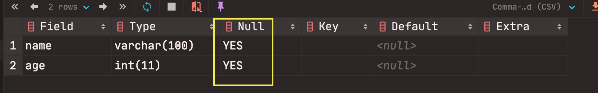
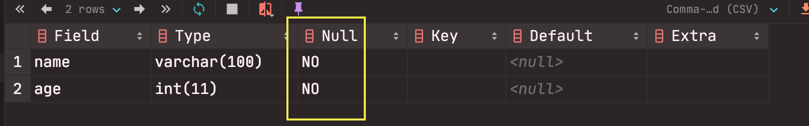
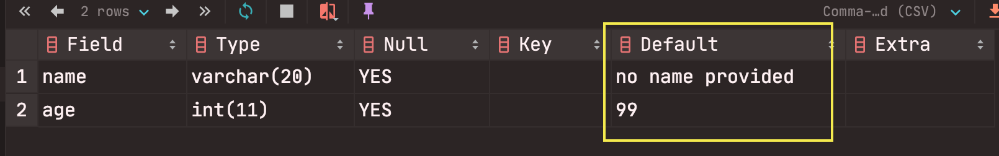
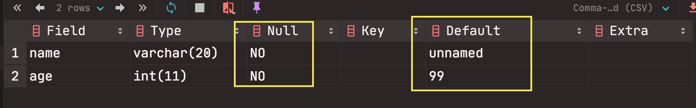

#MySQL DOCUMENTATION
 Create a database
 ------------------
- To create a database : ``CREATE DATABASE database_name;``
- To show list of available database : ``SHOW databases; ``
- To delete a database :```DROP database_name;```
- To use a database : ``USE database_name;`` or `SELECT
 database();``
 
 Create a tables
 ------------------

to create a table: 
 ```
CREATE TABLE table_name
 (
    column_name data_type,
    column_name data_type
  );
```
To be sure the table it's done, we can see all the
 database tables : `SHOW TABLES`
 - To show all the columns of the table :`SHOW COLUMNS FROM
 table_name;` or `DESC table_name; `
 - To delete a table : `DROP TABLE table_name;
 
#### 1 - Insert data in tables
- to insert data in a table(we can insert datas
 in different order)
) : 
`INSERT INTO table_name(column_name) VALUES (data);`
-to see all the content in a table:
`SELECT * FROM table_name; `

we can also insert multiple datas in a table: 
```
INSERT INTO table_name 
               (column_name, column_name) 
   VALUES      (value, value), 
               (value, value), 
               (value, value);
```
#### 2 - NULL concept in table
null means that the value is not known (not
 mean 0)
 
 when inserting a data we can just add one
  column than all the column of the table.the
   rest of the column data will be _`null`_
    because they are empty.
 
 This happen because all tables datas have null
  value as a parameter (it can be check by
   doing `DESC table_name);`
   
   
To prevent a data from null values, we have to
 define that the datas must not be null (with
  `NOT NULL`)
 ```
CREATE TABLE table_name
  (
    column_name data_type NOT NULL,
    column_name data_type NOT NULL
  );
```
then we must enter a value from each column if
 not they will be an error.
 
 
 #### 3 - Set default values in table
 We can create a table with a default value for
  its datas
  ```
CREATE TABLE table_name
  (
    column_name data_type DEFAULT default_value,
    column_name data_type DEFAULT default_value
  );
```

 
We can mixed default values and null values.
```
CREATE TABLE table_name
  (
    column_name data_type NOT NULL DEFAULT default_value’,
    column_name data_type NOT NULL DEFAULT default_value
  );
```
 

 #### 4 - Add a Primary Key in a table 

 To avoid that we repeat a same value to a data,
 we can set a unique primary key to table.it's
 a unique identifier for each data we create.
 
  To create a table with a unique key :
 ```
CREATE TABLE table_name
      (
        column_name data_type NOT NULL,
        column_name data_type,
        column_name data_type,
        PRIMARY KEY (column_name)
      );
```

 
 
 
 
 


