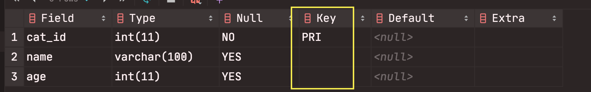

# MySQL DOCUMENTATION
 Create a database
 ------------------
- To create a database : ``CREATE DATABASE database_name;``
- To show list of available database : ``SHOW databases; ``
- To delete a database :```DROP database_name;```
- To use a database : ``USE database_name;`` or `SELECT
 database();``
 
 Create a tables
 ------------------

to create a table: 
 ```
CREATE TABLE table_name
 (
    column_name data_type,
    column_name data_type
  );
```
To be sure the table it's done, we can see all the
 database tables : `SHOW TABLES`
 - To show all the columns of the table :`SHOW COLUMNS FROM
 table_name;` or `DESC table_name; `
 - To delete a table : `DROP TABLE table_name;
 
#### 1 - Insert data in tables
- to insert data in a table(we can insert datas
 in different order)
) : 
`INSERT INTO table_name(column_name) VALUES (data);`
-to see all the content in a table:
`SELECT * FROM table_name; `

we can also insert multiple datas in a table: 
```
INSERT INTO table_name 
               (column_name, column_name) 
   VALUES      (value, value), 
               (value, value), 
               (value, value);
```
#### 2 - NULL concept in table
null means that the value is not known (not
 mean 0)
 
 when inserting a data we can just add one
  column than all the column of the table.the
   rest of the column data will be _`null`_
    because they are empty.
 
 This happen because all tables datas have null
  value as a parameter (it can be check by
   doing `DESC table_name);`
   
   
To prevent a data from null values, we have to
 define that the datas must not be null (with
  `NOT NULL`)
 ```
CREATE TABLE table_name
  (
    column_name data_type NOT NULL,
    column_name data_type NOT NULL
  );
```
then we must enter a value from each column if
 not they will be an error.
 
 
 #### 3 - Set default values in table
 We can create a table with a default value for
  its datas
  ```
CREATE TABLE table_name
  (
    column_name data_type DEFAULT default_value,
    column_name data_type DEFAULT default_value
  );
```

 
We can mixed default values and null values.
```
CREATE TABLE table_name
  (
    column_name data_type NOT NULL DEFAULT default_value’,
    column_name data_type NOT NULL DEFAULT default_value
  );
```
 

 #### 4 - Add a Primary Key in a table 

 To avoid that we repeat a same value to a data,
 we can set a unique primary key to table.it's
 a unique identifier for each data we create.
 
  To create a table with a unique key :
 ```
CREATE TABLE table_name
      (
        column_name data_type NOT NULL,
        column_name data_type,
        column_name data_type,
        PRIMARY KEY (column_name)
      );
```
 
 
 After that we can insert a data in a table
 with unique key for each of them.
 
  #### 5 - Adding AUTO-INCREMENT
  
  we can add a function for the primary key to
   be automatically increment :
   ```
CREATE TABLE table_name (
    column_name_id data_type NOT NULL AUTO_INCREMENT,
    column_name data_type,
    column_name data_type,
    PRIMARY KEY (column_name_id)
);
```
when the auto-increment is added, we don't need
 to specify the value of the column(in most
  case id)
 
Ex: `INSERT INTO unique_cats2(name, age) VALUES
('Skippy', 4);`

  CRUD commands
  ------------------
 
CRUD stands for **Create**, **Read**, **Update** and **Delete**.

  #### 1 - Create a data
  To create( or to insert datas in a table) a
   data we use: `INSERT INTO
   table_name
  (column1_name, column2_name) VALUES
  (column1_value, column2_value); `
  
  #### 2 - Read datas
   To read datas from a database, we use **`SELECT`**
- `select * from table_name` => means give all
 columns from the table.
 
- `select column_name from table_name` => means
 give all data from selected column.
 
- `select column1_name;column2_name from
 table_name` => means
 give all data from selected columns.
 
- we can select by a column_name and add
 specification with `where` .
 Exemple:
    - SELECT * FROM cats WHERE age=4;
    - SELECT * FROM cats WHERE name='Egg'; 
- when we have plenty tables, we can specify
 the values from the column we want by adding
  aliases . `SELECT column1_name AS aliase
  , column2_name
   FROM
   table_name;`
 #### 3 - Update datas
 we can update our datas with **`update`**.
 
```
 UPDATE table_name 
    SET column_name='new_value' 
    WHERE column_name='value_to_update'; 
```
 #### 4 - Delete datas
 
 To delete a data, we use: 
 ```
DELETE FROM table_name WHERE column='value';
```
to delete all datas from a table we use
 : `DELETE FROM table_name`


  Relationship tables (JOIN)
  ------------------
 #### 1 - One to Many Relationship
 it's the most common relationship.
 
 Exemple: Customers and orders => customer can
 have plenty orders but order can belong to
 only one customer.
 see the [one_to_many]("one_to_many.html") file
  for exemple.
 
 To create a table with a foreign key (the key
  which connect the two table) :
  
 ```
 CREATE TABLE table_name1(
      id INT AUTO_INCREMENT PRIMARY KEY,
      column_name data_type,
      column_name data_type
  );
```
 ```
CREATE TABLE table_name2(
    id data_type AUTO_INCREMENT PRIMARY KEY,
    column_name data_type,
    table_name1_id data_type,
    FOREIGN KEY(table_name1_id) REFERENCES
 table_name1(id)
);
```
 To get datas from a relation tables, we can
  join them.

 #####  Inner join
 Select all datas from table 1 and table 2
  where the join condition  met.
  
There are two ways to join two tables:

- implicite inner join : `SELECT * FROM table_1
, table_2 WHERE table_1.id = table_2
.foreign_key_column_id;`

- explicite inner join: `SELECT * FROM table1
                         JOIN table2
                             ON table1.id
                              = table2
                              .foreign_key_column_id;`

 #### 2 - Many to Many Relationship
 
 to create tables ith many: many relations :
 
 ```
CREATE TABLE table1_name (
     id data-type AUTO_INCREMENT PRIMARY KEY,
     column_name1 data-type,
     column_name2 data-type
 );
```

 ```
CREATE TABLE table2_name (
     id data-type AUTO_INCREMENT PRIMARY KEY,
     column_name1 data-type,
     column_name2 data-type
 );
```

 ```
CREATE TABLE table3_name (
     id data-type AUTO_INCREMENT PRIMARY KEY,
     column_name1 data-type,
     column_name2 data-type,
    FOREIGN KEY(table1_name_id) REFERENCES
        table1_name(id),
    FOREIGN KEY(table2_name_id) REFERENCES
        table2_name(id)
 );
```
 
 
